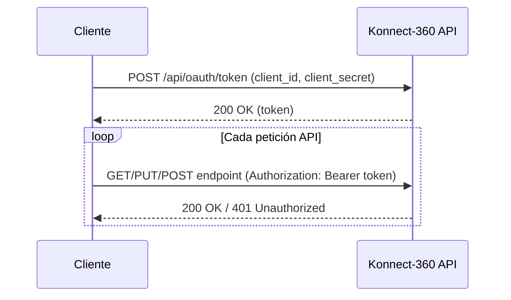

import ApiCodeTabs from '../../../components/ApiCodeTabs.astro';

La API de Konnect-360 utiliza autenticación **OAuth 2.0** con flujo `client_credentials`. Necesitarás tus credenciales (`client_id` y `client_secret`) que puedes obtener en la sección **CANALES** de tu cuenta Konnect-360.

**URL Base:** `https://kservice.konnect-360.pe`

## Obtener Token de Acceso

### Endpoint

```
POST /api/oauth/token
```

### Headers

| Header | Valor |
|--------|-------|
| Content-Type | application/json |

### Body

| Campo | Tipo | Requerido | Descripción | Ejemplo |
|-------|------|-----------|-------------|---------|
| `client_id` | string | Sí | ID de tu cliente | `{{client_id}}` |
| `client_secret` | string | Sí | Secreto de tu cliente | `{{client_secret}}` |
| `grant_type` | string | Sí | Tipo de concesión | `client_credentials` |

### Ejemplos

<ApiCodeTabs>
<Fragment slot="curl">

```bash
curl -X POST https://kservice.konnect-360.pe/api/oauth/token \
  -H "Content-Type: application/json" \
  -d '{
    "client_id": "tu_client_id",
    "client_secret": "tu_client_secret",
    "grant_type": "client_credentials"
  }'
```

</Fragment>
<Fragment slot="javascript">

```javascript
const response = await fetch('https://kservice.konnect-360.pe/api/oauth/token', {
  method: 'POST',
  headers: { 'Content-Type': 'application/json' },
  body: JSON.stringify({
    client_id: 'tu_client_id',
    client_secret: 'tu_client_secret',
    grant_type: 'client_credentials'
  })
});
const data = await response.json();
```

</Fragment>
<Fragment slot="python">

```python
import requests

url = "https://kservice.konnect-360.pe/api/oauth/token"
payload = {
    "client_id": "tu_client_id",
    "client_secret": "tu_client_secret",
    "grant_type": "client_credentials"
}

response = requests.post(url, json=payload)
data = response.json()
```

</Fragment>
<Fragment slot="php">

```php
<?php

$url = "https://kservice.konnect-360.pe/api/oauth/token";
$payload = json_encode([
    "client_id" => "tu_client_id",
    "client_secret" => "tu_client_secret",
    "grant_type" => "client_credentials"
]);
$headers = ["Content-Type: application/json"];

$ch = curl_init($url);
curl_setopt($ch, CURLOPT_POST, true);
curl_setopt($ch, CURLOPT_POSTFIELDS, $payload);
curl_setopt($ch, CURLOPT_HTTPHEADER, $headers);
curl_setopt($ch, CURLOPT_RETURNTRANSFER, true);
$response = curl_exec($ch);
curl_close($ch);
$data = json_decode($response, true);
```

</Fragment>
<Fragment slot="java">

```java
import java.net.URI;
import java.net.http.HttpClient;
import java.net.http.HttpRequest;
import java.net.http.HttpResponse;

var client = HttpClient.newHttpClient();
var request = HttpRequest.newBuilder()
    .uri(URI.create("https://kservice.konnect-360.pe/api/oauth/token"))
    .header("Content-Type", "application/json")
    .POST(HttpRequest.BodyPublishers.ofString("""
        {"client_id": "tu_client_id", "client_secret": "tu_client_secret", "grant_type": "client_credentials"}
    """))
    .build();

var response = client.send(request, HttpResponse.BodyHandlers.ofString());
var data = response.body();
```

</Fragment>
</ApiCodeTabs>

### Respuesta Exitosa (200)

```json
{
  "code": 200,
  "data": { "token": "eyJhbGciOiJIUzI1NiIsInR5cCI6IkpXVCJ9..." },
  "errors": null,
  "messages": "Token válido.",
  "status": 200,
  "success": true
}
```

| Campo | Tipo | Descripción |
|-------|------|-------------|
| `data.token` | string | Token JWT de acceso |

### Respuesta de Error (401)

```json
{
  "code": 401,
  "data": { "token": null },
  "errors": null,
  "messages": "Error: Token y/o Client ID incorrectos.",
  "status": 401,
  "success": false
}
```

## Verificar Token 

### Endpoint

```
GET /api/oauth/token-verify
```

### Headers

| Header | Valor |
|--------|-------|
| Authorization | Bearer `{{token}}` |

### Ejemplos

<ApiCodeTabs>
<Fragment slot="curl">

```bash
curl -X GET https://kservice.konnect-360.pe/api/oauth/token-verify \
  -H "Authorization: Bearer tu_token_aqui"
```

</Fragment>
<Fragment slot="javascript">

```javascript
const response = await fetch('https://kservice.konnect-360.pe/api/oauth/token-verify', {
  headers: { 'Authorization': `Bearer ${token}` }
});
const data = await response.json();
```

</Fragment>
<Fragment slot="python">

```python
import requests

url = "https://kservice.konnect-360.pe/api/oauth/token-verify"
headers = {"Authorization": "Bearer tu_token_aqui"}

response = requests.get(url, headers=headers)
data = response.json()
```

</Fragment>
<Fragment slot="php">

```php
<?php

$url = "https://kservice.konnect-360.pe/api/oauth/token-verify";
$headers = ["Authorization: Bearer tu_token_aqui"];

$ch = curl_init($url);
curl_setopt($ch, CURLOPT_HTTPHEADER, $headers);
curl_setopt($ch, CURLOPT_RETURNTRANSFER, true);
$response = curl_exec($ch);
curl_close($ch);
$data = json_decode($response, true);
```

</Fragment>
<Fragment slot="java">

```java
import java.net.URI;
import java.net.http.HttpClient;
import java.net.http.HttpRequest;
import java.net.http.HttpResponse;

var client = HttpClient.newHttpClient();
var request = HttpRequest.newBuilder()
    .uri(URI.create("https://kservice.konnect-360.pe/api/oauth/token-verify"))
    .header("Authorization", "Bearer tu_token_aqui")
    .GET()
    .build();

var response = client.send(request, HttpResponse.BodyHandlers.ofString());
var data = response.body();
```

</Fragment>
</ApiCodeTabs>

### Respuesta Exitosa (200)

```json
{
  "code": 200,
  "data": {
    "idNumPhone": "155444634329464",
    "idWspBussiness": "203212169544028",
    "phoneNumber": "51914042323"
  },
  "errors": null,
  "messages": "Ok",
  "status": 200,
  "success": true
}
```

| Campo | Tipo | Descripción |
|-------|------|-------------|
| `idNumPhone` | string | ID interno del número de teléfono |
| `idWspBussiness` | string | ID del WhatsApp Business asociado |
| `phoneNumber` | string | Número de teléfono del canal |

### Respuesta de Error (401)

```json
{
  "code": 401,
  "data": null,
  "errors": { "message": "jwt malformed", "name": "JsonWebTokenError" },
  "messages": "jwt malformed",
  "status": 401,
  "success": false
}
```

## Uso del Token

Incluye el token en todas las peticiones como header de autorización:

```
Authorization: Bearer tu_token_aqui
```

:::tip
El token se obtiene una sola vez y se reutiliza en todas las peticiones. Si expira, obtén uno nuevo usando el endpoint de autenticación.
:::

## Errores Comunes

| Código | Mensaje | Descripción |
|--------|---------|-------------|
| 401 | Token y/o Client ID incorrectos | Credenciales inválidas |
| 401 | jwt malformed | Token expiró o tiene formato incorrecto |

## Flujo de Autenticación


