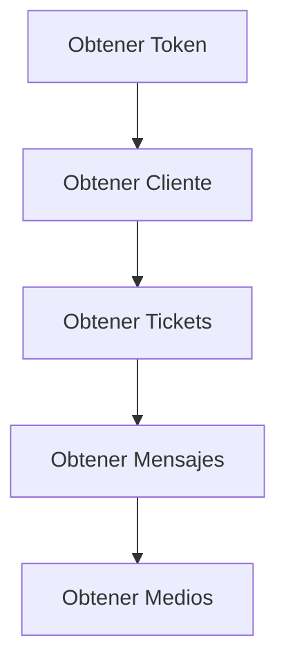

API para extraer y gestionar chats en diferentes canales. Actualmente solo se soporta **WhatsApp**.

**URL Base:** `https://devkapi.konnect-360.pe`

**Requisito:** Primero debes [obtener un token de acceso](/reference/authentication).

## Flujo de Trabajo

## Errores Comunes

| Código | Mensaje | Posible Causa |
|--------|---------|---------------|
| 400 | Error: No hay datos | Cliente o canal no encontrado |
| 200 | No existe customer para consulta de tickets | customer_id inválido |
| 401 | No autorizado | Token expirado o inválido |

## Tips

- Obtén primero el cliente para conseguir el `cus_id`
- Usá `last_msn_id` para paginación de mensajes
- El campo `msn_tipo_str` indica el tipo de contenido multimedia
- El endpoint de medios retorna binario, manejá el Content-Type correctamente
