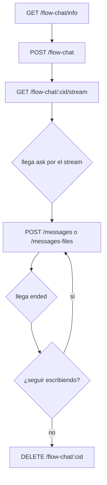

import { BASE_API_IAFLOWS, AUTH_REQUEST_TOKEN } from '../../../constants';

API para chatear contra el **grafo completo** de un workflow conversacional. A diferencia del chat simple (que habla con un solo nodo `aiAgent`), este ejecuta todo el flujo —`ragNode`, `conditional`, `userInput`, las aristas— vía Inngest, con estado persistido en la base. Recargar la página no pierde el hilo.

**URL Base:** <code>{BASE_API_IAFLOWS}</code>

## Conceptos Clave

1. Los POST **no esperan al grafo**: devuelven en cuanto el evento entra a Inngest. Todo resultado llega por el [stream](/flow-chat/stream/).
2. El stream manda el **estado completo** del hilo (sondeo de 1s), no tokens ni incrementos: se reemplaza, no se deduplica. Mientras el nodo piensa solo hay `working` con su etiqueta — no hay "escribiendo…".
3. Un mensaje **contesta o reejecuta**, y el cliente no elige: si hay un `userInput` esperando, lo responde; si no, arranca una vuelta nueva. El campo `mode` dice cuál fue.
4. Los adjuntos viajan como **IDs, nunca como URLs**. La URL la arma el cliente (ver [Adjuntos](/flow-chat/adjuntos/)).

## Flujo Típico de Integración

1. `GET /flow-chat/info` → ¿es conversacional? ¿qué acepta? ¿qué lee el modelo?
2. `POST /flow-chat` → `{ conversationId, executionId }`
3. `GET /flow-chat/:cid/stream` → abrir apenas tenés el `conversationId` (el saludo ya está corriendo)
4. Llega `ask` → mostrar el campo con su `validation`
5. `POST /flow-chat/:cid/messages` o `/messages-files` → `{ mode: "answered" }`
6. Llega `ended` → **no cerrar** el EventSource
7. Escribir de nuevo → `{ mode: "restarted" }`, vuelta nueva, mismo stream
8. `DELETE /flow-chat/:cid` → cerrar y borrar adjuntos

:::note
El rate limit por IP (`429 rate_limited`) no aplica a estos endpoints — solo cubre `/api/workflows/:id/execute` y `/api/visualize/adapt`. Acá el guard es Turnstile, cuando está configurado.
:::

## Chat vs Flow Chat vs Execute

|                        | `/chat`             | `/flow-chat`            | `/execute`           |
|------------------------|---------------------|-------------------------|----------------------|
| Qué corre              | UN nodo aiAgent     | el grafo COMPLETO       | el grafo COMPLETO    |
| Cómo                   | streamText directo  | Inngest                 | Inngest              |
| Durable                | no                  | sí                      | sí                   |
| userInput/delay        | no existen          | sí                      | sí                   |
| Forma de la salida     | tokens (SSE)        | estado del hilo (SSE)   | eventos de nodo (SSE)|
| Conversación           | sí                  | sí                      | no (una corrida)     |
| Adjuntos               | sí                  | sí                      | no                   |
| Pensado para           | iterar un prompt    | un chat de producto     | el panel de ejecución|

`/chat` y `/flow-chat` comparten el AI Agent config (modelo, systemPrompt, tools); la diferencia es cuánto del grafo corre. `/flow-chat` y `/execute` corren lo mismo, pero uno devuelve la conversación ya armada y el otro la traza cruda de nodos.

## Errores Globales

Todos los endpoints pueden devolver estos errores:

| Código | Cuerpo |
|--------|--------|
| 401 | `{ "code": "unauthenticated", "message": "Authentication required" }` |
| 403 | `{ "code": "forbidden", "message": string }` |
| 500 | `{ "code": "internal_error", "message": "Internal server error" }` |
