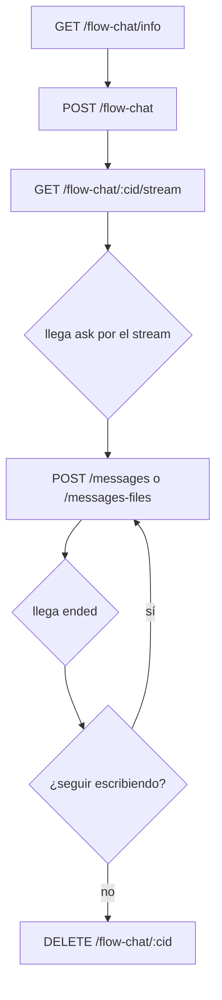

import { Card, CardGrid, Steps } from '@astrojs/starlight/components';
import { BASE_API_IAFLOWS, AUTH_REQUEST_TOKEN } from '../../../constants';

API para chatear contra el **grafo completo** de un workflow conversacional. Ejecuta todo el flujo —`ragNode`, `conditional`, `userInput`, las aristas— vía Inngest, con estado persistido en la base. Recargar la página no pierde el hilo.

**URL Base:** <code>{BASE_API_IAFLOWS}</code>

## Endpoints

<CardGrid>
    <Card title="Info del Flujo" icon="magnifier">
        Reconocimiento del flujo antes de abrir la conversación.

        [Ver endpoint →](/flow-chat/info/)
    </Card>
    <Card title="Abrir Conversación" icon="rocket">
        Crea el hilo y corre la primera vuelta para que el flujo salude.

        [Ver endpoint →](/flow-chat/abrir-conversacion/)
    </Card>
    <Card title="Stream de la Conversación" icon="random">
        Estado completo del hilo en tiempo real vía SSE.

        [Ver endpoint →](/flow-chat/stream/)
    </Card>
    <Card title="Enviar Mensajes" icon="comment">
        Mensajes de texto o con archivos adjuntos.

        [Ver endpoint →](/flow-chat/mensajes/)
    </Card>
    <Card title="Adjuntos" icon="seti:image">
        Bytes de un adjunto del hilo.

        [Ver endpoint →](/flow-chat/adjuntos/)
    </Card>
    <Card title="Cerrar Conversación" icon="close">
        Cancela la corrida, cierra el hilo y borra los adjuntos.

        [Ver endpoint →](/flow-chat/cerrar-conversacion/)
    </Card>
</CardGrid>

## Conceptos Clave

1. Los POST **no esperan al grafo**: devuelven en cuanto el evento entra a Inngest. Todo resultado llega por el [stream](/flow-chat/stream/).
2. El stream manda el **estado completo** del hilo (sondeo de 1s), no tokens ni incrementos: se reemplaza, no se deduplica. Mientras el nodo piensa solo hay `working` con su etiqueta — no hay "escribiendo…".
3. Un mensaje **contesta o reejecuta**, y el cliente no elige: si hay un `userInput` esperando, lo responde; si no, arranca una vuelta nueva. El campo `mode` dice cuál fue.
4. Los adjuntos viajan como **IDs, nunca como URLs**. La URL la arma el cliente (ver [Adjuntos](/flow-chat/adjuntos/)).

## Flujo de Trabajo

<Steps>

1. [Obtener token](/authentication/)

2. [Info del Flujo](/flow-chat/info/) → ¿es conversacional? ¿qué acepta? ¿qué lee el modelo?

3. [Abrir Conversación](/flow-chat/abrir-conversacion/) → te da el `conversationId` y el `executionId`

4. [Stream](/flow-chat/stream/) → abrir apenas tenés el `conversationId` (el saludo ya está corriendo)

5. Llega `ask` por el stream → mostrar el campo con su `validation`

6. [Enviar Mensajes](/flow-chat/mensajes/) → responde el `ask` o arranca una vuelta nueva (`mode`)

7. Llega `ended` → **no cerrar** el EventSource: escribir de nuevo reusa la misma conexión

8. [Cerrar Conversación](/flow-chat/cerrar-conversacion/) → cierra el hilo y borra los adjuntos

</Steps>

:::note
El rate limit por IP no aplica a estos endpoints. Acá el guard es Turnstile, cuando está configurado, y devuelve `403 verification_required` o `403 verification_failed`.
:::

## Errores Comunes

Todos los endpoints pueden devolver estos errores:

| Código | Cuerpo | Posible Causa |
|--------|--------|---------------|
| 401 | `{ "code": "unauthenticated", "message": "Authentication required" }` | Falta el header `Authorization` o el token expiró |
| 403 | `{ "code": "forbidden", "message": string }` | Turnstile rechazó la verificación |
| 500 | `{ "code": "internal_error", "message": "Internal server error" }` | Falla del servidor |

## Tips

- Abrí el stream apenas tenés el `conversationId`: el saludo del flujo ya está corriendo
- El `executionId` es de una sola vuelta; el `conversationId` es el que va en todos los endpoints
- No cierres el EventSource cuando llega `ended`: la misma conexión sirve para la vuelta siguiente
- Consultá [`modelReads`](/flow-chat/info/) antes de habilitar audio o video en la UI
